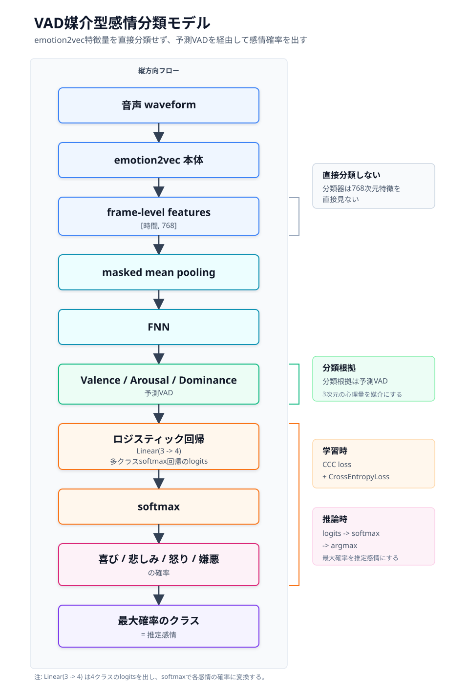

# emotion2vecリポジトリの学習構造まとめ

最終更新: 2026-07-16

## 全体像

このリポジトリは、大きく分けて次の3つの部分で構成されています。

1. `upstream/`  
   emotion2vec本体。音声から感情に関係する特徴量を抽出するモデル。

2. `iemocap_downstream/`  
   emotion2vec特徴量を使って、IEMOCAPの4クラス感情分類を行うモデル。

3. `vad_downstream/`  
   emotion2vec特徴量を使って、Valence / Arousal / Dominance の連続値を予測する回帰モデル。
   さらに、予測したVADを経由して感情分類するモデルも扱う。

基本的な流れは次の通りです。

```text
音声 waveform
  ↓
emotion2vec 本体
  ↓
frame-level features: [時間, 768]
  ↓
下流モデル
  ↓
感情分類 または VA/VAD回帰
```

## モデルは何層か

emotion2vec本体は、主に以下の構成です。

| 部分 | 内容 |
|---|---|
| CNN特徴抽出器 | 7層 |
| audio prenet | Transformer風ブロック 4層 |
| メインTransformer | 8層 |
| 特徴次元 | 768 |
| Attention head数 | 12 |

そのため、Transformer風ブロックとしては `4 + 8 = 12層` と見るのが自然です。

一方、下流モデルはかなり小さいです。

### IEMOCAP分類モデル

```text
Linear(768 → 256)
  ↓
ReLU
  ↓
平均pooling
  ↓
Linear(256 → 4)
```

4クラスは以下です。

```text
angry / happy / neutral / sad
```

### VA/VAD回帰モデル（2層のニューラルネットワーク）

```text
平均pooling
  ↓
Linear(768 → hidden_dim)
  ↓
ReLU
  ↓
Linear(hidden_dim → 2 or 3)
```

既定値は `hidden_dim=256` なので、実際の形は次の通りです。

```text
Linear(768 → 256)
  ↓
ReLU
  ↓
Linear(256 → 2 or 3)
```

`Linear` は「リニア」と読み、日本語では「線形層」または「全結合層」と呼びます。
この2層は、768次元のemotion2vec特徴をVA/VADの2次元または3次元へ変換する回帰headです。

出力は次のどちらかです。

```text
VA:  valence, arousal
VAD: valence, arousal, dominance
```

学習用の正解VA/VADは `[-1, 1]` に正規化します。ただし、現在の回帰headの最終層には
`tanh` などの範囲制約がないため、予測値が数学的に必ず `[-1, 1]` に収まるわけではありません。

### VAD経由分類モデル



現在実装されているVAD媒介型分類は、感情分類の前にVA/VADを明示的に通す形です。

```text
emotion2vec特徴量
  ↓
平均pooling
  ↓
FNN
  ↓
valence / arousal (/ dominance)
  ↓
Linear(2 or 3 → 4)
  ↓
hap / sad / ang / dis
```

最後の `Linear(2 or 3 → 4)` は、予測VA/VADを入力にした多クラスロジスティック回帰に相当します。
分類器はemotion2vecの768次元特徴を直接見ず、予測されたVADだけを見て分類します。

VAD回帰部分は2つのLinear層ですが、4クラス分類まで含めるとLinear層は合計3つです。

```text
第1層: Linear(768 → 256)
第2層: Linear(256 → 2 or 3)
第3層: Linear(2 or 3 → 4)
```

モデルは必要に応じて、次の両方を返せます。

```text
vad:    [valence, arousal] または [valence, arousal, dominance]
logits: hap / sad / ang / dis の4つの分類スコア
```

`logits` はsoftmax適用前のスコアです。推論時にはsoftmaxを適用して4クラスの確率に変換します。

そのため、新しい音声に対して次のように説明できます。

```text
この音声は valence が低く、arousal が高いため、
VADを入力にした分類器が angry の確率を高く出した。
```

この構造は、直接分類より性能が下がる可能性はありますが、
「なぜその感情に分類されたのか」をVADで説明しやすいのが利点です。

## 活性化関数

活性化関数は、ニューラルネットワークに非線形性を与える関数です。

線形層だけを何層重ねても、結局は1つの線形変換と同じような表現しかできません。  
そこで、`ReLU` や `GELU` のような活性化関数を挟むことで、複雑な関係を学習できるようにします。

このリポジトリでは主に以下が使われています。

| 場所 | 活性化関数 |
|---|---|
| IEMOCAP分類モデル | ReLU |
| VA/VAD回帰head | ReLU |
| VAD経由分類head | なし |
| emotion2vec本体 | GELU |

分類モデルの最後には `Softmax` は明示されていません。  
これは、PyTorchの `CrossEntropyLoss` が内部で `log_softmax` 相当の処理を行うためです。

## 損失関数

### IEMOCAP分類

IEMOCAPの4クラス分類では、損失関数として `CrossEntropyLoss` が使われています。

```text
予測logits と 正解ラベル を比較する分類用の損失
```

正解クラスのスコアが高いほど損失は小さくなります。

### VA/VAD回帰

VA/VAD回帰では、`CCC loss` が使われています。

CCC は Concordance Correlation Coefficient の略です。  
単なる誤差だけでなく、以下をまとめて評価します。

- 予測と正解の相関
- 平均値のズレ
- 分散のズレ

損失は次の形です。

```text
loss = 1 - mean(CCC)
```

完全に一致すると、

```text
CCC = 1
loss = 0
```

になります。

### VAD経由分類

VADを分類根拠として使う場合は、学習時にVAD回帰の損失も残すのが重要です。
分類損失だけで学習すると、中間の3次元が本当のVADではなく、
分類しやすい任意の3次元表現になってしまう可能性があります。

そのため、現在の実装では次の複合損失を使います。

```text
loss = lambda_vad * VAD回帰loss
     + lambda_emo * 感情分類loss
```

具体的には、次の組み合わせです。

```text
VAD回帰loss: CCC loss
感情分類loss: CrossEntropyLoss
```

`lambda_vad` と `lambda_emo` の既定値はどちらも `1.0` です。

## 勾配の扱い

学習処理は、典型的なPyTorchの流れです。

```python
optimizer.zero_grad()
prediction = model(...)
loss = criterion(prediction, target)
loss.backward()
optimizer.step()
```

それぞれの意味は次の通りです。

| 処理 | 意味 |
|---|---|
| `optimizer.zero_grad()` | 前のbatchの勾配を消す |
| `model(...)` | 予測を出す |
| `criterion(...)` | 損失を計算する |
| `loss.backward()` | 誤差逆伝播で勾配を計算する |
| `optimizer.step()` | 勾配を使って重みを更新する |

波形入力を受けるVA/VADモデルでは、デフォルトでemotion2vec本体を固定します。

```text
freeze_encoder=True
```

つまり、emotion2vec本体の重みは更新せず、後ろに付けた回帰headだけを学習します。

また、現在の主な学習CLIは事前抽出済みemotion2vec特徴を入力とするため、学習対象は
VAD回帰headとVADから4クラスを出す分類headです。この状態は厳密には
「emotion2vec本体のfine-tuning」ではなく「固定特徴上のhead tuning」です。

`Emotion2vecVADModel` 自体は `freeze_encoder=False` も受け取れますが、実データを波形から読み、
encoderまで更新する一連のfine-tuning用学習パイプラインは、現時点の主経路にはなっていません。

このリポジトリ内では、明示的な gradient clipping は見当たりません。

## 主なハイパーパラメータ

### emotion2vec本体

| パラメータ | 値 |
|---|---:|
| `embed_dim` | 768 |
| `depth` | 8 |
| `num_heads` | 12 |
| `mlp_ratio` | 4 |
| `encoder_dropout` | 0.1 |
| `average_top_k_layers` | 8 |
| `mask_prob` | 0.7 |
| `mask_length` | 5 |

### IEMOCAP分類

| パラメータ | 値 |
|---|---:|
| `batch_size` | 128 |
| `epoch` | 100 |
| `lr` | 5e-4 |
| optimizer | RMSprop |
| scheduler | CyclicLR |
| 出力クラス数 | 4 |

### VA/VAD回帰

| パラメータ | 値 |
|---|---:|
| `epochs` | 10 |
| `batch_size` | 32 |
| `lr` | 1e-3 |
| `weight_decay` | 0.0 |
| `hidden_dim` | 256 |
| optimizer | AdamW |
| `target_dim` | 2 or 3 |

### VAD媒介型4クラス分類

| パラメータ | 値 |
|---|---:|
| `input_dim` | 768 |
| `hidden_dim` | 256 |
| `target_dim` | 2 or 3 |
| `num_classes` | 4 |
| クラス順 | `hap, sad, ang, dis` |
| `lambda_vad` | 1.0 |
| `lambda_emo` | 1.0 |

## まとめ

このリポジトリの基本思想は、次のようにまとめられます。

```text
大きなemotion2vec本体で音声特徴を抽出し、
小さな下流モデルで分類や回帰を行う
```

現在のVAD媒介型モデルを一行で表すと、次のようになります。

```text
音声 → emotion2vec特徴 → 平均pooling → 2層のVAD回帰head
     → 予測VA/VAD → 1層の4クラス分類head → hap/sad/ang/dis
```

この構造の特徴は、最終分類器が768次元特徴を直接使わず、2次元または3次元の
予測VA/VADだけを使う点です。情報を圧縮するため直接分類より性能が下がる可能性はありますが、
各クラスのlogitを `bias + weight * VAD` に分解でき、分類根拠を説明しやすくなります。

初心者が読むなら、まずは以下の順番がおすすめです。

1. `vad_downstream/model.py`  
   小さな回帰モデルの構造がわかりやすい。

2. `vad_downstream/training.py`  
   損失関数、勾配計算、重み更新の流れが見やすい。

3. `iemocap_downstream/model.py`  
   分類モデルの基本構造がわかる。

4. `upstream/models/`  
   emotion2vec本体のTransformer構造を確認できる。
