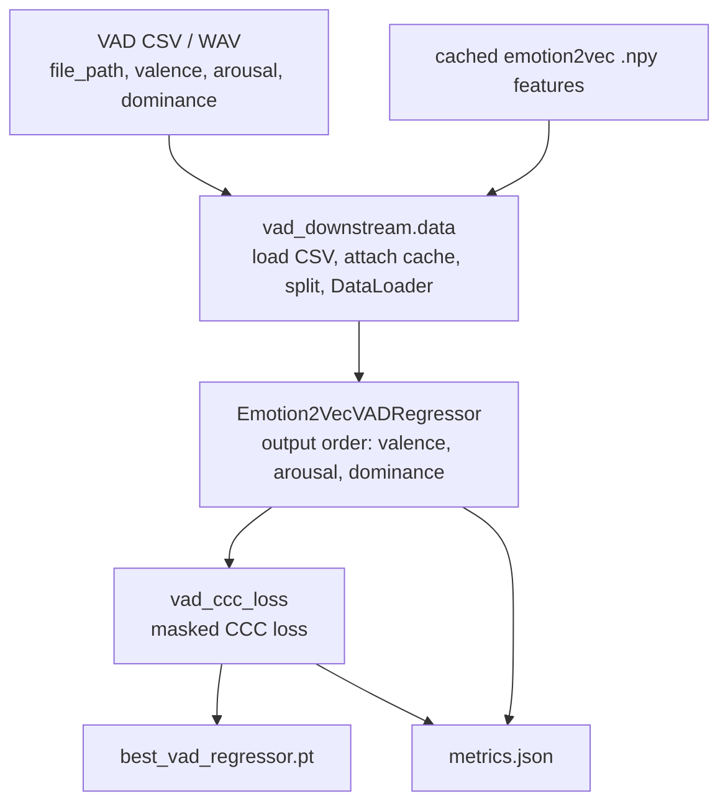
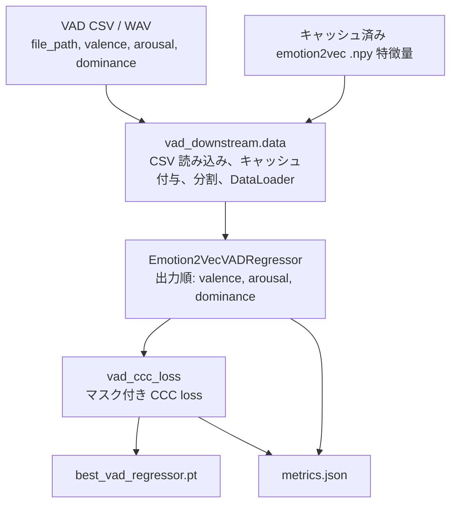

# emotion2vec workspace map

This repository keeps the original emotion2vec code and adds a cleaned VAD
regression path.

## Main path: VAD regression

| Path | Role |
|---|---|
| `vad_downstream/train_vad.py` | Main VAD training entrypoint for cached emotion2vec features |
| `vad_downstream/model.py` | `Emotion2VecVADRegressor`, output order `valence, arousal, dominance` |
| `vad_downstream/loss.py` | CCC loss with missing-label masking |
| `vad_downstream/data.py` | CSV loading, cache path creation, splitting, VAD DataLoader |
| `vad_downstream/config/default.yaml` | Reference VAD regression settings |
| `vad_downstream/README.md` | VAD CSV/cache/training usage |

## Reference implementations

| Path | Role |
|---|---|
| `upstream/` | Original emotion2vec/fairseq model and task definitions |
| `scripts/extract_features.py` | Single-WAV emotion2vec feature extraction |
| `iemocap_downstream/` | Original IEMOCAP 4-class downstream classifier |
| `iemocap_downstream/scripts/` | IEMOCAP manifest and batch feature extraction utilities |

## Fixtures and experiments

| Path | Role |
|---|---|
| `tests/fixtures/vad_dummy/` | Small VAD CSV and cached dummy features for smoke tests |
| `tests/test_vad_downstream.py` | Minimal VAD data/loss/training tests |
| `notebooks/` | Experimental notebooks kept out of the main execution path |
| `archive/vad_iemocap_two_stage/` | Old VAD-intermediate IEMOCAP classification experiment |
| `archive/plans/` | Historical planning notes |
| `archive/notebook_tools/` | One-off notebook patching tools |
| `docs/references/` | Papers, extracted paper text, and reference notes |

## Data flow

## Japanese translation

このリポジトリは、元の emotion2vec コードを保持しつつ、整理済みの
VAD 回帰パスを追加したワークスペースです。

## メインパス: VAD 回帰

| パス | 役割 |
|---|---|
| `vad_downstream/train_vad.py` | キャッシュ済み emotion2vec 特徴量を使う VAD 学習のメインエントリポイント |
| `vad_downstream/model.py` | `Emotion2VecVADRegressor`。出力順は `valence, arousal, dominance` |
| `vad_downstream/loss.py` | 欠損ラベルのマスクに対応した CCC loss |
| `vad_downstream/data.py` | CSV 読み込み、キャッシュパス生成、分割、VAD DataLoader |
| `vad_downstream/config/default.yaml` | VAD 回帰設定の参照用デフォルト |
| `vad_downstream/README.md` | VAD 用 CSV、キャッシュ、学習手順 |

## 参照実装

| パス | 役割 |
|---|---|
| `upstream/` | 元の emotion2vec/fairseq モデルとタスク定義 |
| `scripts/extract_features.py` | 単一 WAV からの emotion2vec 特徴抽出 |
| `iemocap_downstream/` | 元の IEMOCAP 4 クラス下流分類器 |
| `iemocap_downstream/scripts/` | IEMOCAP の manifest 作成とバッチ特徴抽出ユーティリティ |

## フィクスチャと実験

| パス | 役割 |
|---|---|
| `tests/fixtures/vad_dummy/` | スモークテスト用の小さな VAD CSV とキャッシュ済みダミー特徴量 |
| `tests/test_vad_downstream.py` | VAD データ、loss、学習の最小テスト |
| `notebooks/` | メイン実行パスから外して保持している実験ノートブック |
| `archive/vad_iemocap_two_stage/` | 古い VAD 中間表現を使った IEMOCAP 分類実験 |
| `archive/plans/` | 過去の計画メモ |
| `archive/notebook_tools/` | ノートブック修正用の一回限りのツール |
| `docs/references/` | 論文、抽出済み論文テキスト、参照メモ |

## データフロー

