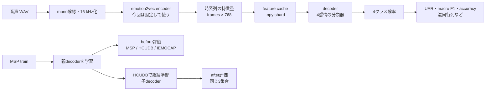

# MSP-Podcast→HCUDB音声感情認識実験の準備記録 — 特徴抽出と分類器学習の仕組みを実装・動作確認（2026-08-23）

## 1. 音声を特徴量に変換し、4感情を分類する実験システムの実装（MSP実音声での本実験は未実施）

### この記録の目的と読み方

この記録は、2026-08-23までに行った作業を、次の3つの目的で残すものである。

1. 研究を始めた本人が、あとから処理の全体像を理解できるようにする。
2. 分からない箇所を、項目名や質問番号を指定して質問できるようにする。
3. 卒業論文などで、実装方法・検証結果・未実施事項を区別して説明するための証拠を残す。

最初からすべて理解する必要はない。まず「最初に結論」と「研究全体を一枚で」を読み、その後、気になった語を「用語集」で確認する。詳しい実装は「実施内容」、現在の到達点は「できたこと／まだできていないこと」を参照する。

この記録には、うまくいったことだけでなく、MSP-Podcastの音声がなくて実行できなかったことも残す。研究では「実装できた」「テストできた」「実データで結果が出た」は別の事実であるため、意図的に分けて記述する。

### 最初に結論

今回行ったのは、音声感情認識の正式な実験結果を出す前段階として、データを安全に読み、emotion2vecで特徴量を作り、その特徴量だけを使って感情分類器を学習・評価できる一式の仕組みを作ることである。

現時点の最重要点は次のとおりである。

- データ監査、ラベル統一、話者分割、特徴量cache、分類器、評価、checkpoint、Notebook、テストを実装した。
- HCUDBの実音声1件から、emotion2vec Baseの`62 × 768`特徴量を実際に抽出できた。
- 小さな合成データでは、MSP学習→3データセット評価→HCUDB継続学習→同じ3データセット再評価、という全工程を最後まで通せた。
- しかし、MSP-Podcastの`Audio/`が空なので、MSPの実音声特徴量は1件も抽出していない。
- したがって、実MSPでの分類器学習、実HCUDBへの継続学習、研究用の精度・UAR・F1の結果は、まだ存在しない。

「プログラムという実験装置は作って動作確認したが、MSPの試料がないため本実験はまだ始めていない」という状態である。

### 研究全体を一枚で



処理を大きく2段階に分けた。

1. **特徴抽出段階**: WAVをemotion2vecに入力し、各時刻の768次元特徴量をcacheへ保存する。
2. **decoder段階**: 保存済み特徴量だけを読み、4感情を予測する分類器を学習・評価する。

この分離により、分類器を作り直すたびに重いemotion2vecを再実行する必要がなくなる。また、decoder側ではWAV、fairseq、emotion2vec checkpointを必要としないため、どの処理が特徴抽出で、どの処理が分類器学習なのかを明確にできる。

身近な例にすると、emotion2vec encoderは音声を多数の数値へ変換する「測定器」、feature cacheは「測定結果を保存した台帳」、decoderはその測定値から感情名を決める「判定規則」に相当する。

### 用語集

| 用語 | やさしい説明 | 今回どこで使うか |
|---|---|---|
| dataset | 研究で使う音声と説明情報のまとまり | MSP-Podcast、HCUDB1、IEMOCAP |
| metadata | 音声ID、話者、感情ラベルなどを記した表 | 実音声がなくても件数・ラベル・splitを監査した |
| WAV | 実際の音声ファイル | emotion2vecへ入力する元データ |
| utterance | 1つの発話、つまり今回の処理単位となる音声1件 | manifestや評価確率を発話単位で保存する |
| label | その発話に付けられた感情名 | データセット固有ラベルを4感情へ対応させた |
| mapping | 異なるラベル表記を共通ラベルへ対応させる規則 | MSP/HCUDB/IEMOCAPを同じ4クラスへそろえた |
| class index | 感情名を0から始まる整数にしたもの | anger=0、happy=1、sadness=2、disgust=3 |
| split | データを学習・調整・最終評価用に分けたもの | train、validation、test |
| speaker-independent | 学習と評価で同じ話者を使わない条件 | HCUDBを10/2/2話者に固定した |
| leakage | 本来見せてはいけない評価情報が学習側へ混入すること | 話者ID、発話ID、音声hashの重複を検査する |
| manifest | どの音声を、どのラベル・splitで使うかを1行1発話で記した台帳 | UTF-8 JSONLの`ser_manifest_v1` |
| JSONL | 1行ごとに1個のJSONを保存するテキスト形式 | manifestとshard indexに使用する |
| SHA-256 | ファイル内容から計算する長い識別値 | 音声、manifest、cache、checkpointの同一性確認に使う |
| encoder | 音声を機械学習向けの数値表現へ変えるモデル | emotion2vec Base |
| feature | encoderが音声から取り出した数値列 | 各frameが768個の数値を持つ |
| frame | 音声を短い時間単位に区切ったときの1時点 | 1発話が`frame数 × 768`の配列になる |
| layer | neural network内部のどの段階の出力を使うか | 今回は最終出力`final_after_encoder_norm`だけを許可する |
| cache | 一度計算した特徴量を再利用するための保存場所 | `.npy` shardとindexで構成する |
| shard | 大量の特徴量を扱いやすい大きさに分けたファイル | 約65,536 framesを上限の目安にした |
| mmap | 巨大な配列全体を一度にRAMへ載せず、必要部分だけ読む方法 | decoderがshardから各発話を遅延読込する |
| decoder | 特徴量から4感情を予測する分類器 | `BaseModel`と学習・評価処理 |
| masked mean pooling | 長さの異なる発話について、paddingを除いたframe特徴量の平均を取る処理 | decoderへ固定長の発話表現を渡す |
| padding | 長さの異なる発話を同じbatchへ入れるために末尾へ足すダミー部分 | poolingやlossに混入させないようmaskする |
| checkpoint | 学習済みmodelの重みと再現用情報を保存したファイル | MSP親checkpointとHCUDB子checkpoint |
| parent checkpoint | 前段階で学習済みの重みを、次の学習の初期値として使うもの | MSP学習済みdecoderからHCUDB学習を開始する |
| resume checkpoint | 中断した同一runを、optimizerやepochも含めて再開するもの | parentとは別の操作として実装した |
| seed | 乱数の初期値 | 42、43、44で同じ条件を再現できるようにする |
| train | modelの重みを更新するデータ | MSP Train、HCUDBの10話者 |
| validation | model選択や学習停止判断に使うデータ | MSP Development、HCUDBの2話者 |
| test | model選択には使わず、最終性能を測るデータ | MSP Test1、HCUDBの2話者、外部IEMOCAP |
| accuracy / WA | 全発話のうち正解した割合 | 同じ値を両方の名前で0–1保存する |
| UAR | 各クラスのrecallを同じ重みで平均した値 | validationで最優先のmodel選択指標 |
| macro F1 | 各クラスのF1を同じ重みで平均した値 | UAR同率時の第2選択指標 |
| confusion matrix | 真の感情と予測感情の組合せを数えた表 | 真値を行、予測を列とする4×4表 |
| probability | 4感情それぞれらしさを0–1で表した値 | 発話ごとに4確率をCSV/JSONへ保存する |
| E2E test | 入力準備から最終出力まで一連の処理を通すテスト | 合成データで親学習からafter評価まで確認した |
| benchmark | 1件の処理時間・shape・容量などを測る試行 | HCUDB実音声1件で実施した |
| preflight | 長時間の正式実行前に、必要条件を確認する事前点検 | データ欠損、hash、容量、互換性を確認する |
| limitation | 結果を解釈するときの制約・注意点 | 事前学習データ重複リスクや未確認事項を残す |

---

### 目的

研究上の目的は、次の比較を同じ4クラス・同じ指標・同じ評価発話で安全に実行できるようにすることである。

1. MSP-Podcastでdecoderを学習する。
2. その時点のdecoderをMSP Test1、HCUDB test、IEMOCAPで評価し、`before`結果とする。
3. 同じdecoderを初期値としてHCUDBで継続学習する。
4. 同じ3評価集合でもう一度評価し、`after`結果とする。

特徴抽出とdecoder学習を分離し、特徴量を一度だけcacheへ保存することで、decoder実験を再現しやすくすることも目的である。

### 実行前の状態

- MSP-Podcast R1.10はmetadataのみ存在し、`Audio/`は空だった。
- HCUDB1はmetadataとWAVが各4,620件あり、相互欠損はなかった。
- IEMOCAPはmetadataと有効WAVが各10,039件あり、Session 1–5を確認できた。
- AppleDoubleの`._*`は実音声ではないため、IEMOCAPの音声件数へ含めない必要があった。
- emotion2vec Base checkpointは存在し、サイズは1,125,606,009 bytesだった。
- 既存コードには再利用できるemotion2vec読込、decoder、話者分割、指標計算があったが、3データセット共通の契約、再開可能cache、親子checkpoint、2段階Notebookはなかった。
- Windows Python 3.13には必要な`torch`と`soundfile`がなく、基準環境は`TESTING.md`記載のWSL Python 3.10とした。
- 実装開始時の既存テスト基準は76件成功だった。
- `docs/plans/2026-08-22-plan-mode-implementation-prompt.md`にはユーザーの未commit変更があったため、編集対象から除外した。

### 確定した研究条件

#### 共通クラス順

出力順を常に次の4クラスへ固定した。

| index | class |
|---:|---|
| 0 | `anger` |
| 1 | `happy` |
| 2 | `sadness` |
| 3 | `disgust` |

この順序はmanifest、feature cache、decoder checkpoint、評価確率のすべてで一致させる。順序が違うcheckpointやcacheを誤接続すると、数値は読めても感情名が入れ替わる危険があるため、metadata一致を必須にした。

#### データセット別mapping

| dataset / version | 採用規則 | 除外規則・注意 |
|---|---|---|
| MSP `msp_podcast_r1_10_primary_v1` | `A→anger`、`H→happy`、`S→sadness`、`D→disgust` | `C,F,N,O,U,X`、Test2、Unknown話者を主対象から除外 |
| HCUDB `hcudb1_acted_emotion_v1` | `怒り→anger`、`狂喜・楽しい/余裕・嬉しい→happy`、`憂鬱・悲しい→sadness`、`嫌い→disgust` | 残り6演技感情を除外。「嫌い」は完全な同義ではないので近似対応フラグを付与 |
| IEMOCAP `iemocap_external_v1` | `ang→anger`、`hap/exc→happy`、`sad→sadness`、`dis→disgust` | `fea,fru,neu,oth,sur,xxx`を除外 |

metadataの元ラベルは削除せず、採用しない行も除外理由と一緒にmanifestへ残す設計にした。

#### split

MSPは公式partitionをそのまま使用する。

| MSP source | 今回のsplit | 扱い |
|---|---|---|
| Train | `train` | decoder学習 |
| Development | `validation` | model選択 |
| Test1 | `test` | 主評価 |
| Test2 | なし | 全件監査するが、今回の学習・評価・cacheから除外 |

HCUDBは次の話者固定分割を`hcudb1_speaker_split_v1`としてversion管理した。

| split | 話者 |
|---|---|
| train | `FA, FB, FD, FH, FI, FL, MC, MJ, MM, MN` |
| validation | `FF, MK` |
| test | `FG, ME` |

この分割では、学習・validation・testに同じ話者が入らない。性別ごとに話者IDを辞書順に並べ、`random.Random(42)`でshuffleし、validationとtestへ男女各1名を割り当てた結果を固定ファイルへ保存した。

IEMOCAPはSession 1–5をまとめて外部testとする。`disgust`の正解発話が2件しかないため、4クラスの記述評価に加えて、真値`disgust`を除いた3クラス集計も保存する。ただしdecoder出力は4クラスのままとし、確率を3クラスへ再正規化しない。3クラス集計でも`disgust`と予測した場合は誤りとして扱う。

---

### 実施内容

#### 1. 既存作業の保護と計画・監査文書の更新

**何をしたか**

- 実装前の`git status`を確認し、元からdirtyだったファイルを特定した。
- 現行計画は`docs/plans/2026-08-22-msp-hcudb-feature-decoder-plan.md`だけを更新した。
- データ監査結果を`docs/reports/2026-08-23-msp-hcudb-data-audit.md`へ保存した。
- 実行環境とテスト方法を`.env.example`と`TESTING.md`へ追記した。
- dirtyな`docs/plans/2026-08-22-plan-mode-implementation-prompt.md`は編集・整形・復元しなかった。

**なぜ必要か**

既存のユーザー変更を壊さず、どの条件で実装したかを論文・再実行時に確認できるようにするためである。

**確認結果**

dirty promptのSHA-256は作業前後とも`350E56822B8CC57F530376433AFFAB78D7B780ED0D7553C8A59A5E4D0C3C0A93`で、byte単位で不変だった。既存の旧3 Notebookも変更していない。

#### 2. 共通定数とversion付きmapping

**何をしたか**

- `ser_pipeline/contracts.py`にクラス順、形式version、必須契約を定義した。
- `ser_pipeline/config/mappings.v1.json`に3データセットのmappingを保存した。
- `tests/test_ser_mappings.py`で採用・除外・近似対応・未知ラベル拒否をテストした。

**なぜ必要か**

データセットごとに感情名が異なるため、同じdecoderで比較するには、対応関係と出力順を固定する必要がある。設定をversion管理すると、あとから規則を変えた実験と混同しにくい。

**どこまで確認したか**

実metadataに含まれる元ラベルを監査し、4クラス対象件数がMSP 25,985件、HCUDB 2,100件、IEMOCAP 3,825件になることを確認した。

**この確認だけでは言えないこと**

ラベルを対応させられたことは、3データセットの感情表現が心理学的・文化的に完全に同じであることを証明しない。特にHCUDBの「嫌い→disgust」は研究上の近似対応である。

#### 3. dataset readerと共通manifest

**何をしたか**

- `ser_pipeline/readers.py`へMSP、HCUDB、IEMOCAPのreaderを実装した。
- `ser_pipeline/manifest.py`へ共通manifestの作成、読込、hash、strict検証を実装した。
- `ser_pipeline/cli.py`と`ser_pipeline/__main__.py`へ`audit-data`、`build-manifest`、`validate-manifest`などのCLI入口を作った。
- Unicodeラベル、相対path、欠損、重複ID、AppleDouble除外、安定したmanifest hashをテストした。

**manifestに保存する情報**

- データセット名・release・発話ID・音声相対path・音声SHA-256
- 話者ID・話者ID状態・group・session
- 元split・共通split・split version
- 元感情・共通感情・class index・mapping version
- 採用可否・除外理由・近似対応フラグ
- 音声サイズ・sample rate・channel数・sample数・秒数

形式名は`ser_manifest_v1`で、UTF-8 JSONLとした。ローカルPC固有の絶対pathは保存せず、音声rootと相対pathを分離した。

**strict buildの意味**

正式manifestでは、採用する全発話について実音声の存在とSHA-256を必須にする。MSPで実行すると25,985件すべての音声がないため、次の内容で意図どおり拒否された。

```text
strict manifest requires every included audio file; missing 25985
(first: MSP-PODCAST_0001_0019)
```

これは実装失敗ではなく、不完全なデータで正式実験を始めないための安全動作である。

#### 4. split固定と漏洩検査

**何をしたか**

- `ser_pipeline/splits.py`へ話者、発話ID、音声hashのsplit間重複検査を実装した。
- `ser_pipeline/config/hcudb1_speaker_split.v1.json`へHCUDBの10/2/2話者を固定した。
- `tests/test_ser_splits.py`で正常な分割と、意図的に漏洩させたfixtureの両方をテストした。
- MSPの既知話者についてTrain、Development、Test1間の重複が0件であることを実metadataで確認した。
- MSPの`SpkrID=Unknown`が採用行に残っていれば拒否するようにした。

**なぜ必要か**

同じ話者の声を学習とtestの両方へ入れると、感情ではなく話者固有の声質を覚えて得点が高くなる可能性がある。HCUDBをMSP Test1と同様の話者独立評価へそろえるため、話者単位で分離した。

#### 5. 音声前処理・特徴抽出・再開可能cache

**何をしたか**

- `ser_pipeline/audio.py`へmono確認、有限値確認、0 sample拒否、16 kHz化を実装した。
- 16 kHz以外の音声は`scipy.signal.resample_poly`で変換するようにした。
- 多channel音声、0 frame、非有限値、特徴次元不一致を拒否するようにした。
- `ser_pipeline/features.py`へemotion2vecの最終特徴を取り出す契約を実装した。
- `--layer`は`final`だけを許可し、整数の中間層指定は明示的に拒否した。
- `ser_pipeline/cache.py`へshard作成、index、hash、`_SUCCESS`、再開、破損検出、mmap読込を実装した。
- 既存のemotion2vec抽出scriptとshellを共通処理へ接続した。

**cacheの保存形**

```text
cache-root/
  dataset/
    split/
      shard-00000.npy
      shard-00000.index.jsonl
      shard-00001.npy
      shard-00001.index.jsonl
      _SUCCESS
  cache_meta.json
```

各`.npy`には複数発話のframe特徴量を縦に連結する。indexには発話ID、開始offset、frame数を保存する。decoderは`np.load(..., mmap_mode="r")`で必要な発話部分だけを読む。

作成途中は`.partial`として保存し、完成後にhashを確定して正式名へ原子的に切り替える。再実行時には完成済みshardを検証してskipし、不完全なshardだけを作り直す。この仕組みは長時間抽出が途中で止まったときのために必要である。

`cache_meta.json`にはencoder名、checkpoint SHA-256、特徴層`final_after_encoder_norm`、特徴次元、float32、抽出コード版、git commit、manifest hash、mapping/split version、16 kHz前処理、shard policyを保存する。

**どこまで確認したか**

fake encoderで複数shard作成、途中再開、partial復旧、mmap読込、hash破損、metadata不一致をテストした。さらにHCUDBの実音声1件で本物のemotion2vec checkpointを読み、48 kHzから16 kHzへ変換して`62 × 768`の有限なfloat32特徴を抽出した。

**この確認だけでは言えないこと**

HCUDB 1件の成功は、MSP全25,985件が抽出できること、全件速度、必要容量を保証しない。MSPの音声時間分布が分からないため、正式見積りには使っていない。

#### 6. 特徴抽出Notebook 01

**何をしたか**

- `scripts/build_ser_notebooks.py`でNotebookを再現可能に生成できるようにした。
- `notebooks/01_extract_emotion2vec_features.ipynb`を作成した。
- データ監査、mapping/split表示、manifest/cache検証、1件benchmark、全件コマンドpreviewを担当させた。
- `RUN_FULL_EXTRACTION=False`を既定値にし、Notebookを開いただけで長時間抽出が始まらないようにした。
- optimizer、epoch loop、`BaseModel`、decoder checkpoint操作がNotebook 01へ混入していないことを静的テストした。

**役割**

Notebook 01は「音声から特徴量cacheを作る場所」であり、decoderを学習する場所ではない。この境界をテストで固定した。

#### 7. dataset非依存decoder・metrics・checkpoint

**何をしたか**

- `ser_pipeline/model.py`へ共通`BaseModel`を実装した。
- `ser_pipeline/training.py`へ可変長batch、padding、学習loop、validation model選択を実装した。
- `ser_pipeline/evaluation.py`へ指標、混同行列、クラス別結果、発話別確率、集合signatureを実装した。
- `ser_pipeline/checkpoints.py`へ安全な保存・読込・互換性検査を実装した。
- `iemocap_downstream/model.py`から互換re-exportし、旧importとstate dictとの互換性を維持した。

**model選択規則**

1. validation UARが高いmodelを選ぶ。
2. UARが同じならmacro F1が高いmodelを選ぶ。
3. それも同じならvalidation lossが小さいmodelを選ぶ。

test結果をmodel選択に使わないことで、testへの過剰適合を避ける。

**保存する評価結果**

- accuracyとWA（同じ値だが両名で保存）
- UARとmacro F1
- validation/test loss
- 真値が行、予測が列の4×4混同行列
- クラス別precision、recall、F1、support
- 各発話の正解ラベル、予測ラベル、4クラス確率
- manifest hashと発話ID集合hash

指標は0–1で保存し、Notebook表示時だけ必要に応じて百分率へ変換する。

**checkpoint契約**

- MSP checkpointは`training_stage=msp_train`。
- HCUDB checkpointは`training_stage=hcudb_continue`。
- 子checkpointに親checkpoint IDと親ファイルSHA-256を保存する。
- label order、model構成、input dim、seed、encoder/checkpoint/layer署名が異なる接続は拒否する。
- `--parent-checkpoint`は新しいoptimizerで次段階を始める操作。
- `--resume-checkpoint`は同じrunのoptimizerとepochを復元する操作。

#### 8. MSP→HCUDB継続学習studyとNotebook 02

**何をしたか**

- `ser_pipeline/study.py`へMSP親学習、before評価、HCUDB子学習、after評価を一括実行する流れを実装した。
- `ser_pipeline/notebook_api.py`へNotebookから呼ぶ短いAPIを実装した。
- `notebooks/02_train_and_evaluate_decoder.ipynb`を作成した。
- seed 42、43、44の正式study設定を用意した。
- 正式実行フラグを既定falseにした。
- Notebook 02がWAV、`soundfile`、fairseq、emotion2vec checkpoint/user-dirを参照しないことを静的テストした。

**before/afterの公平性検査**

MSP Test1、HCUDB test、IEMOCAPについて、beforeとafterでmanifest hashと発話ID hashが一致しなければ比較を拒否する。同じ試験問題で比較したことを機械的に保証するためである。

#### 9. 合成E2E、回帰テスト、preflight

**何をしたか**

- `tests/fixtures/ser4_dummy/`へ4クラスの小さな合成fixtureを作った。
- `tests/test_ser_e2e.py`で次の全工程をCPU・少数sample・1 epochで通した。

```text
合成manifest
→ shard cache
→ MSP decoder学習
→ 親checkpoint
→ MSP/HCUDB/IEMOCAPのbefore評価
→ HCUDB継続学習
→ 子checkpoint
→ 同じ3集合のafter評価
```

- 親子checkpoint ID/SHA-256、before/after集合signature、評価ファイル出力を確認した。
- 新規unit testと既存回帰testをまとめて実行した。
- Notebook 01と02をdemo設定で実行した。
- HCUDB実音声1件でcheckpoint load、前処理、抽出時間、device、特徴shape、容量を測定した。

**重要な区別**

合成E2Eは、処理の接続や保存形式のバグを見つけるためのテストである。そこで得たaccuracyやF1は人工的な小データの値であり、研究結果として報告してはいけない。

---

### 実データ監査結果

| dataset | metadata全件 | 今回の4クラス対象 | 話者 | 対象音声の状態 |
|---|---:|---:|---:|---|
| MSP-Podcast R1.10 | 104,267 | 25,985 | 既知1,432 | 25,985件すべて欠損 |
| HCUDB1 | 4,620 | 2,100 | 14 | 欠損0 |
| IEMOCAP | 10,039 | 3,825 | 10 | 欠損0 |

IEMOCAPではAppleDouble `._*` 1,819件を音声inventoryから除外した。有効WAVとmetadataは各10,039件で一致した。

#### MSP公式partitionの監査

| source split | metadata件数 | 今回の扱い |
|---|---:|---|
| Train | 63,076 | `train`候補 |
| Development | 10,999 | `validation`候補 |
| Test1 | 16,903 | `test`候補 |
| Test2 | 13,289 | 監査のみ、主manifestでは除外 |

4クラスmapping、Test2除外、Unknown話者除外を同時に適用した件数が25,985件である。

### HCUDB実音声1件benchmark

| 項目 | 結果 |
|---|---:|
| 音声 | `FA-01-01-1.wav` |
| 元形式 | mono / 48 kHz / 1.2587秒 |
| 前処理 | `scipy.signal.resample_poly`で16 kHz化 |
| device | CPU |
| checkpoint読込 | 66.271秒 |
| 前処理 | 1.905秒（初回importを含む） |
| 特徴抽出 | 0.417秒 |
| 特徴shape | `62 × 768` |
| dtype | float32 |
| 特徴容量 | 190,464 bytes |
| layer | `final_after_encoder_norm` |

使用したemotion2vec Base checkpointの情報は次のとおりである。

- サイズ: 1,125,606,009 bytes
- SHA-256: `4f14ddf7ba394bcafdd4bff6ae0f24ab2e4134260d4dd42c58ea791a201b02dd`
- 測定時のCドライブ空き: 96,816,496,640 bytes（90.17 GiB）

これは動作確認用の1件benchmarkであり、MSP全件の時間・容量見積りではない。

### 検証

| 検証対象 | 結果 | 何を意味するか |
|---|---|---|
| 実装前の既存test | 76件成功 | 既存機能の開始時基準を記録した |
| 最終test | 101件成功、16.030秒 | 既存testと新規unit/E2EがWSL Python 3.10で成功した |
| Notebook 01 demo | 成功 | 長時間抽出なしで監査・境界・表示を確認した |
| Notebook 02 demo | 成功 | WAV/fairseq/emotion2vecなしのdecoder側demoを確認した |
| MSP strict manifest | 意図どおり拒否 | 対象音声25,985件の欠損を見逃さなかった |
| fake encoder cache | 成功 | shard、再開、partial復旧、mmap、hash検証が動作した |
| 合成study E2E | 成功 | 親学習→before→子学習→afterが接続できた |
| HCUDB実音声1件 | 成功 | 本物のcheckpointで48→16 kHz、62×768特徴抽出を確認した |
| dirty prompt保護 | SHA-256不変 | ユーザーの既存変更を上書きしていない |

今回この作業ログを追加した時点では、コードを変更していないため101 testの再実行はしていない。文書のMarkdown差分と空白エラーだけを確認する。

### 判定

#### できたこと／まだできていないこと

| 項目 | 状態 | 研究上の意味 |
|---|---|---|
| 3データセットのmetadata監査 | 実データで完了 | 件数、ラベル、話者、split、欠損を把握した |
| 4クラスmapping | 実装・test完了 | 3データセットを同じ出力順で扱える |
| HCUDB固定話者split | 実装・test完了 | 話者独立の10/2/2評価条件を固定した |
| 共通manifest | 実装・合成test完了 | 採否理由と音声情報を追跡できる |
| 再開可能feature cache | 実装・合成test完了 | 中断や巨大配列に対応する仕組みを確認した |
| decoder・metrics・checkpoint | 実装・合成test完了 | 特徴量だけで学習・評価できる |
| Notebook 01/02 | demo完了 | 特徴抽出とdecoder学習の役割を分離した |
| HCUDB実特徴抽出 | 1件完了 | 本物の音声とcheckpointの接続を確認した |
| MSP実特徴抽出 | **0件・未実施** | `Audio/`が空なので開始できない |
| 実MSP decoder学習 | **未実施** | 実特徴cacheがないため開始できない |
| 実HCUDB継続学習 | **未実施** | 実MSP親checkpointがないため研究条件を満たせない |
| 実データbefore/after評価 | **未実施** | 研究用の性能値はまだない |
| MSP全件時間・容量見積り | **未実施** | 音声durationを取得できない |
| 正式実行 | **ゲート不合格** | ユーザーの開始指示以前に、まずMSP音声配置が必要 |

#### 論文に書けること

- 特徴抽出とdecoder学習を分離した設計。
- 3データセットを共通4クラスへ対応させた規則と除外規則。
- MSP公式split、HCUDB固定話者split、IEMOCAP外部testという評価設計。
- manifest、cache、checkpointの再現性・完全性確認方法。
- データ監査件数とMSP音声欠損というpreflight結果。
- unit/E2E test、Notebook demo、HCUDB 1件benchmarkの事実。
- emotion2vec事前学習とMSP-Podcast v1.8の重複リスクをlimitationとして扱う方針。

#### まだ論文の実験結果として書いてはいけないこと

- MSP-Podcastでのaccuracy、WA、UAR、macro F1。
- HCUDB継続学習によって性能が上がった／下がったという結論。
- IEMOCAPへの外部一般化性能。
- seed 42/43/44の平均・標準偏差。
- 合成E2Eで出た数値を、実データの性能として扱うこと。
- HCUDB実音声1件の速度をMSP全件へそのまま外挿した所要時間。

### 専門用語・研究上の主張の確認

| 主張 | 判定 | 根拠・扱い |
|---|---|---|
| `emotion2vec`は実在する音声感情表現modelである | ✅ 確認済み | Ma et al. (2024) の一次論文を確認 |
| emotion2vecの事前学習にMSP-Podcast v1.8が使われた | ✅ 確認済み | 同論文Table 1にMSP-Podcast (V1.8)がpretrain対象として記載される |
| MSP-Podcast v1.8はR1.10の完全な部分集合である | ❌ 未確認 | v1.8 metadataがローカルにないため比較不能。論文で断定しない |
| HCUDBの「嫌い」と`disgust`は完全に同じ概念である | ⚠️ 近似対応 | 同義と断定せず、`approximate_mapping=true`を保存する研究上の規則 |
| 合成E2E成功は実データで高性能であることを示す | ❌ 示さない | 実装経路の動作確認であり、性能評価ではない |

一次資料: [Ma et al., “emotion2vec: Self-Supervised Pre-Training for Speech Emotion Representation,” Findings of ACL 2024](https://aclanthology.org/2024.findings-acl.931/)

この重複リスクは、emotion2vecが過去にMSP-Podcast v1.8を見ている可能性ではなく、論文Table 1により実際に事前学習へ使用したことが確認されている点に注意する。ただし、今回使用予定のR1.10のどの発話がv1.8と重なるかは未確認である。したがって、将来得るMSP評価値にはこのlimitationを必ず付記する。

### 実行後の状態

#### 主な実装ファイルと役割

| path | 役割 |
|---|---|
| `ser_pipeline/contracts.py` | クラス順、形式version、共通契約 |
| `ser_pipeline/config/mappings.v1.json` | 3データセットのラベルmapping |
| `ser_pipeline/config/hcudb1_speaker_split.v1.json` | HCUDB固定10/2/2話者split |
| `ser_pipeline/readers.py` | MSP/HCUDB/IEMOCAP metadata reader |
| `ser_pipeline/manifest.py` | manifest作成、hash、strict検証 |
| `ser_pipeline/splits.py` | 話者・発話・音声hashの漏洩検査 |
| `ser_pipeline/audio.py` | mono、16 kHz化、音声妥当性検証 |
| `ser_pipeline/features.py` | emotion2vec最終特徴の抽出契約 |
| `ser_pipeline/cache.py` | shard cache、再開、hash、mmap |
| `ser_pipeline/model.py` | 共通decoder `BaseModel` |
| `ser_pipeline/training.py` | decoder学習とvalidation選択 |
| `ser_pipeline/evaluation.py` | 指標、混同行列、確率、集合signature |
| `ser_pipeline/checkpoints.py` | 親子/resume checkpointと互換性検査 |
| `ser_pipeline/study.py` | MSP→HCUDBのbefore/after study |
| `ser_pipeline/notebook_api.py` | Notebook 02から使う短いAPI |
| `ser_pipeline/preflight.py` | 正式実行前の監査・benchmark補助 |
| `ser_pipeline/cli.py` | 監査、manifest、cacheなどのCLI |
| `notebooks/01_extract_emotion2vec_features.ipynb` | 特徴抽出側Notebook |
| `notebooks/02_train_and_evaluate_decoder.ipynb` | decoder学習・評価側Notebook |
| `scripts/build_ser_notebooks.py` | Notebook 01/02の再生成 |
| `tests/test_ser_mappings.py` | mapping test |
| `tests/test_ser_manifest.py` | reader/manifest test |
| `tests/test_ser_splits.py` | split/leakage test |
| `tests/test_ser_cache.py` | audio/feature/cache test |
| `tests/test_ser_decoder.py` | model/training/evaluation/checkpoint test |
| `tests/test_ser_notebook_boundaries.py` | Notebook責務分離test |
| `tests/test_ser_e2e.py` | 合成study全工程test |
| `tests/fixtures/ser4_dummy/` | 4クラス合成fixture |
| `docs/reports/2026-08-23-msp-hcudb-data-audit.md` | 実データ監査と正式実行ゲート |
| `docs/reports/2026-08-23-hcudb1-feature-benchmark.json` | HCUDB 1件benchmarkの機械可読値 |
| `TESTING.md` | WSL環境、test、Notebook demoの実行記録 |

#### 既存コードへの互換変更

- `iemocap_downstream/model.py`: 新しい共通`BaseModel`を旧pathからもimportできるようにした。
- `iemocap_downstream/scripts/emotion2vec_speech_features.py`: 共通feature契約を使えるようにした。
- `iemocap_downstream/scripts/emotion2vec_extract_features.sh`: 新しい抽出条件へ接続した。
- `requirements.txt`: 16 kHz変換などに必要な依存関係を整理した。
- `.env.example`: データrootや実行設定の例を追加した。

### 次回の最小ステップ

次に必要なのは、MSP-Podcast R1.10の実音声を正しい`Audio/`へ配置することである。配置後は、いきなり全件抽出を始めず、次の順で進める。

1. 25,985対象音声がmetadataと一致するかstrict監査する。
2. Unknown、未知ラベル、話者・発話・音声hashの漏洩が0件か確認する。
3. 正式manifestを作り、そのhashを確定する。
4. 対象音声の総durationを計算する。
5. 少数のMSP実音声で抽出benchmarkを行う。
6. 全件時間とfeature cache容量を見積もる。
7. cache容量に20%余裕を加えてもディスクが安全か確認する。
8. manifest hash、出力先、予定時間、必要容量をユーザーへ提示する。
9. ユーザーの明示的な開始指示を受けてから全件抽出する。

### まだやらないこと

- MSP音声がない状態で、空または偽のMSP cacheを正式結果として作らない。
- MSP全件抽出や正式decoder学習を開始しない。
- MSP Test2を今回の学習・評価へ加えない。
- Base/Large比較、公式9クラスhead、VAD媒介型、IEMOCAP 5-foldを今回へ追加しない。
- integerの中間layerを、意味が未確定なまま使用しない。
- 合成データの指標を論文の実験結果として報告しない。
- v1.8とR1.10の包含関係を、metadata比較なしに断定しない。

---

### 質問カタログ

以下は、この記録を読んで分からなかったときに、そのまま尋ねられる質問である。「質問3を図で説明して」「質問12を具体例で」のように番号指定できる。

1. encoderとdecoderは何が違うのか。
2. なぜWAVから直接感情を予測せず、特徴量をcacheするのか。
3. manifestとは何で、普通のCSVと何が違うのか。
4. train、validation、testはなぜ3つ必要なのか。
5. speaker-independent評価はなぜ必要なのか。
6. 話者漏洩があると、なぜ結果を信用しにくくなるのか。
7. なぜMSPのUnknown話者を除外したのか。
8. MSP Test2を監査するのに、学習・評価では使わないのはなぜか。
9. 3データセットの違う感情ラベルを、どうやって4クラスへそろえたのか。
10. HCUDBの「嫌い→disgust」が近似対応とはどういう意味か。
11. emotion2vecの`62 × 768`は、62と768がそれぞれ何を意味するのか。
12. `final_after_encoder_norm`とは何か。なぜ整数layerを拒否したのか。
13. sample rate 48 kHzを16 kHzへ変えると何が起こるのか。
14. shard、offset、index、mmapはどのように一緒に働くのか。
15. `.partial`と`_SUCCESS`は、処理中断からどう守るのか。
16. SHA-256で何が分かり、何は分からないのか。
17. masked mean poolingとpadding maskを簡単な数値例で説明してほしい。
18. UARとaccuracyは何が違うのか。なぜUARでmodelを選ぶのか。
19. macro F1、precision、recallを4感情の例で説明してほしい。
20. 4×4混同行列をどう読めばよいのか。
21. parent checkpointとresume checkpointは何が違うのか。
22. before/afterで発話ID hashを一致させるのはなぜか。
23. seed 42、43、44を使う理由は何か。
24. 合成E2E成功と、実データの研究結果は何が違うのか。
25. MSPのmetadataがあるのに、なぜ特徴量を作れないのか。
26. MSP音声を配置した後、どのコマンドをどの順で実行するのか。
27. この実装のどの部分を卒業論文の「手法」「実験条件」「結果」「限界」に書けるのか。
28. emotion2vecがMSP v1.8を事前学習に使ったことは、評価へどう影響し得るのか。
29. IEMOCAPの`disgust`が2件しかないことを、どう報告・解釈すべきか。
30. 101件のtestはそれぞれ何を守っており、test成功でも保証されないことは何か。

### 理解チェック

次の5点を自分の言葉で言えれば、現在地の中心部分を理解できている。

1. 今回は「実験装置の実装・動作確認」までで、「MSPを使った本実験結果」はまだない。
2. 音声→emotion2vec特徴量と、特徴量→4感情decoderは別の段階である。
3. HCUDBのtrain/validation/testでは話者を重複させない。
4. 合成E2Eの得点は研究成果の性能値ではない。
5. 次のblockerはMSPの実音声25,985件が欠損していることである。

このうち1つでも曖昧なら、上の質問カタログの番号を指定して確認する。

### 関連記録

- 実装計画: `docs/plans/2026-08-22-msp-hcudb-feature-decoder-plan.md`
- データ監査と正式実行ゲート: `docs/reports/2026-08-23-msp-hcudb-data-audit.md`
- HCUDB 1件benchmark: `docs/reports/2026-08-23-hcudb1-feature-benchmark.json`
- 実行環境とtest記録: `TESTING.md`
- 特徴抽出Notebook: `notebooks/01_extract_emotion2vec_features.ipynb`
- decoder学習・評価Notebook: `notebooks/02_train_and_evaluate_decoder.ipynb`
