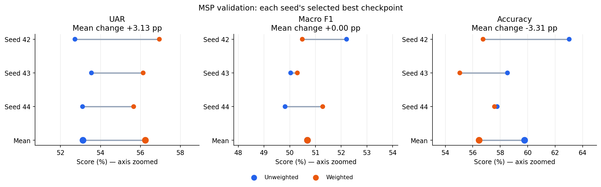
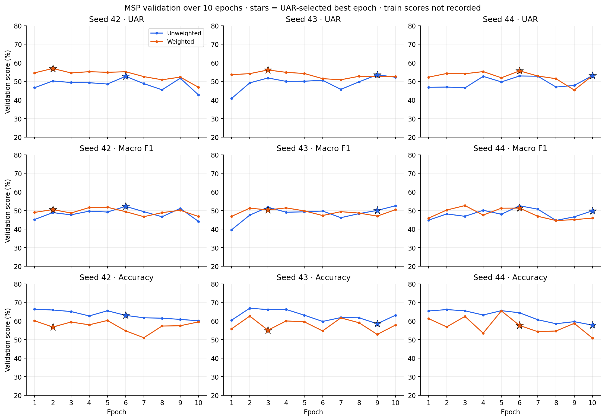
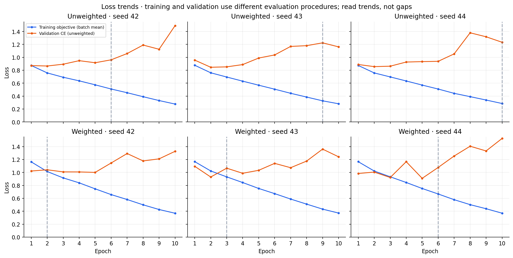
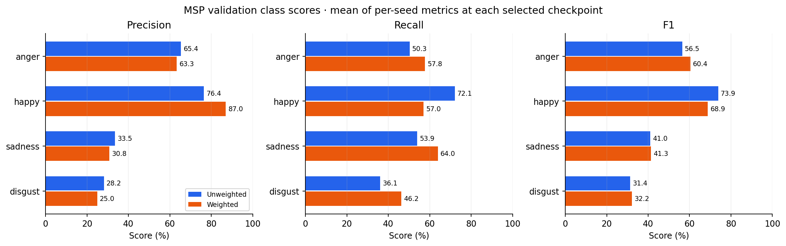
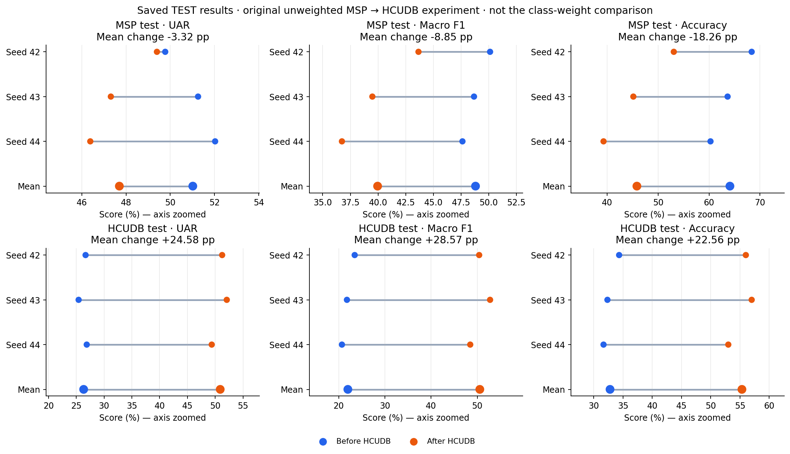
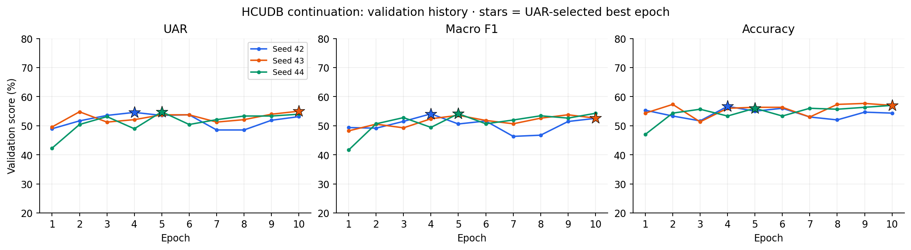

# 保存済み結果の整理：MSPのクラス重み比較とHCUDB追加学習

2026-09-03｜seed 42・43・44｜各10 epoch｜保存済みJSONのみを集計。音声・特徴キャッシュ・checkpoint本体は読み込まず、新しい学習・推論・test評価は実行していません。

主な結果：MSPの重み付けでvalidation UARは3 seedすべて改善しました。macro F1は平均ではほぼ不変、正解率は低下しました。学習lossは低下していますが、trainの分類scoreが未記録なので、trainとvalidationのscore差は算出できません。

## 1. 保存済みの数値で確認できる範囲

| 実験 | train | validation | test |
| --- | --- | --- | --- |
| MSP 重みなし・3 seed | 各epochの学習lossのみ | 各epochのscore・loss・クラス別成績 | HCUDB追加学習前の結果あり |
| MSP 重みあり・3 seed | 各epochの重み付き学習lossのみ | 各epochのscore・loss・クラス別成績 | 未評価 |
| HCUDB追加学習・3 seed | 各epochの学習lossのみ | 各epochのscore・loss・クラス別成績 | 追加学習後の両データセットの結果あり |

trainのUAR・macro F1・正解率は、今回の保存結果にはありません。空欄を推定値やvalidationの値で埋めていません。時間計測用に再実行したseed 42は元の履歴・評価指標と一致することを確認し、4個目の独立seedとして数えていません。

## 2. MSP：重みなし・ありのvalidation比較

各seedのvalidation UARで選んだbest checkpoint同士を比較しています。同点時はmacro F1、次にlossを使用します。epoch数・バッチサイズ・モデル・学習率などの設定と、保存されたvalidation集合signatureの一致を確認しました。scoreは百分率、差は百分率ポイントです。±は3 seedの標本標準偏差で、信頼区間ではありません。

| 指標 | 重みなし：平均 ± SD | 重みあり：平均 ± SD | 平均差（ポイント） |
| --- | --- | --- | --- |
| UAR | 53.13 ± 0.41 | 56.25 ± 0.65 | +3.13 |
| Macro F1 | 50.69 ± 1.32 | 50.69 ± 0.52 | +0.00059 |
| Accuracy | 59.78 ± 2.84 | 56.46 ± 1.29 | -3.31 |

| seed | 損失設定 | best epoch | UAR (%) | macro F1 (%) | 正解率 (%) | validation loss |
| --- | --- | --- | --- | --- | --- | --- |
| 42 | Unweighted | 6 | 52.72 | 52.21 | 63.03 | 0.9615 |
| 42 | Weighted | 2 | 56.95 | 50.49 | 56.75 | 1.0420 |
| 43 | Unweighted | 9 | 53.55 | 50.04 | 58.53 | 1.2243 |
| 43 | Weighted | 3 | 56.14 | 50.30 | 55.06 | 1.0665 |
| 44 | Unweighted | 10 | 53.10 | 49.82 | 57.78 | 1.2332 |
| 44 | Weighted | 6 | 55.66 | 51.28 | 57.58 | 1.0779 |

UARの改善は『各感情の再現率を等しく平均した成績』の改善です。macro F1も一緒に改善したとは言えず、重み付けで全体的な分類性能が一律に上がった、またはtestでも改善したとは結論しません。

## 3. MSP：学習は進んでいたか

| seed | 損失設定 | train loss：epoch 1 → 10 | validation loss：epoch 1 → 10 | best UAR (%) | epoch 10 UAR (%) | 最終−best（ポイント） |
| --- | --- | --- | --- | --- | --- | --- |
| 42 | Unweighted | 0.8737 → 0.2769 | 0.8722 → 1.4908 | 52.72 | 42.75 | -9.98 |
| 42 | Weighted | 1.1642 → 0.3691 | 1.0227 → 1.3277 | 56.95 | 46.83 | -10.12 |
| 43 | Unweighted | 0.8776 → 0.2813 | 0.9571 → 1.1621 | 53.55 | 52.24 | -1.31 |
| 43 | Weighted | 1.1678 → 0.3721 | 1.0956 → 1.2426 | 56.14 | 52.63 | -3.51 |
| 44 | Unweighted | 0.8746 → 0.2855 | 0.8890 → 1.2332 | 53.10 | 53.10 | +0.00 |
| 44 | Weighted | 1.1669 → 0.3701 | 0.9847 → 1.5269 | 55.66 | 53.00 | -2.66 |

train lossは学習中にモデルを更新しながら得たバッチlossの平均です。validation lossはepoch終了時のモデルで計算した、発話平均の重みなしcross entropyです。特に重みあり学習では損失関数の重みが異なるので、train lossとvalidation lossの絶対値を直接比較できません。重みなしとありのtrain lossも同じ尺度の成績として比較していません。

観察：MSPの6実行すべてで、epoch 10のtrain lossはepoch 1より低くなっています。一方、重みありのbest epochは42: 2、43: 3、44: 6で、10 epoch目のUARはいずれもbestを下回っています。最適化は進んでおり、後半にvalidationの改善へつながらなくなる傾向が見られます。過学習を疑う材料ですが、trainの分類scoreがないため、その差を使った確認はできません。『学習不足だからepochを増やせば改善する』とも、この結果だけでは言えません。

## 4. MSP：どの感情の成績が変わったか

以下は各seedのbest validationでのクラス別指標を計算後、3 seedで平均した値です。平均混同行列からF1を再計算したものではありません。validationは3,600件、happyは1,808件（50.22%）です。

| 感情 | validation件数 | precision (%)：なし → あり | recall (%)：なし → あり | F1 (%)：なし → あり |
| --- | --- | --- | --- | --- |
| anger | 1044 | 65.40 → 63.29 | 50.32 → 57.76 | 56.50 → 60.35 |
| happy | 1808 | 76.44 → 87.01 | 72.11 → 57.04 | 73.86 → 68.86 |
| sadness | 296 | 33.54 → 30.79 | 53.94 → 63.96 | 41.03 → 41.34 |
| disgust | 452 | 28.19 → 24.96 | 36.14 → 46.24 | 31.37 → 32.21 |

happyの再現率低下が正解率を押し下げ、他3クラスの再現率改善がUARを押し上げています。sadnessとdisgustは再現率が向上した一方でprecisionが低下し、F1の改善は小さくなっています。これは『見せかけの成績の修正』ではなく、予測が変化して生じたクラス間の成績のトレードオフです。

## 5. 保存済みtest：HCUDBへの追加学習前後

この節は元の重みなしMSP→HCUDB実験の保存済みtest結果です。今回のMSP重み付け実験とは別です。beforeはMSP学習後、afterはHCUDB追加学習後を意味します。before/afterと3 seed間で同じ評価集合signatureであることを確認しました。

| test集合 | 指標 | 追加学習前：平均 ± SD | 追加学習後：平均 ± SD | 差（ポイント） |
| --- | --- | --- | --- | --- |
| msp_podcast | UAR | 51.02 ± 1.15 | 47.70 ± 1.54 | -3.32 |
| msp_podcast | Macro F1 | 48.81 ± 1.25 | 39.96 ± 3.48 | -8.85 |
| msp_podcast | Accuracy | 64.09 ± 4.06 | 45.83 ± 6.92 | -18.26 |
| hcudb1 | UAR | 26.32 ± 0.79 | 50.90 ± 1.39 | +24.58 |
| hcudb1 | Macro F1 | 21.99 ± 1.39 | 50.56 ± 2.15 | +28.57 |
| hcudb1 | Accuracy | 32.78 ± 1.39 | 55.33 ± 2.08 | +22.56 |

HCUDBのtest成績は3 seedすべてで向上しました。一方、MSPのtest成績はUAR・macro F1・正解率のすべてで3 seedとも低下しました。HCUDBへの適応とMSPでの性能維持には、この保存済み実験で明確な差が見られます。

| seed | HCUDB best epoch | validation UAR (%) | validation macro F1 (%) | validation正解率 (%) |
| --- | --- | --- | --- | --- |
| 42 | 4 | 54.58 | 54.09 | 56.67 |
| 43 | 10 | 55.00 | 52.60 | 57.00 |
| 44 | 5 | 54.79 | 54.13 | 56.00 |

## 6. 結果の参照とデータ漏洩について

保存済み結果を表やグラフに整理すること自体は、testデータを学習入力に混ぜることではありません。ただし、test由来の指標を見てモデル・重み・epochなどを選び直すと、元の音声や特徴に触れていなくても、testの情報が設定選択に入ります。結果ファイルだから無条件に影響がない、という扱いにはしません。今回の整理では設定を選び直していません。validationは設定選択に使い、testの既存結果は記述的な振り返りとして区別しています。

根拠：[scikit-learn公式資料：Cross-validation: evaluating estimator performance](https://scikit-learn.org/stable/modules/cross_validation.html)

## 7. 時間記録と出典

全実験で同じ範囲の時間が保存されていないため、以下は記録範囲を明示した参考値です。Notebookを起動してからの実時間と同一とは限りません。

| 実行 | 記録された範囲 | 分 |
| --- | --- | --- |
| 高速化後 seed 42 | study処理（入口のキャッシュ完全検証を除く） | 76.45 |
| 高速化後 seed 42 | 入口のキャッシュ完全検証（2データセット合計） | 9.27 |
| 重みあり seed 42 | 比較処理（準備セルの完全検証を除く） | 92.35 |
| 重みあり seed 43・44 | 比較処理合計（準備セルの完全検証を除く） | 131.97 |

集計元6ファイルの相対パスとSHA-256をsource_manifest.jsonに保存しました。元のresult JSONを上書きしていません。集計用JSONには発話ID・個別予測を含めず、表とグラフの数値のみを収録しています。

runs/msp_class_weight_comparison/seeds-42/comparison_summary.json

runs/msp_class_weight_comparison/seeds-43-44/comparison_summary.json

runs/ser_decoder_study/formal/initial-seed-42/study_summary.json

runs/ser_decoder_study/formal/followup-seeds-43-44/study_summary.json

runs/ser_decoder_timing_check_20260903/formal/initial-seed-42/study_summary.json

runs/ser_decoder_timing_check_20260903/formal/initial-seed-42/study_timings.json
